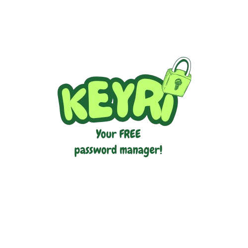

# keyri

Local password manager with deep cascade security layers for those who are looking to protect their credentials. Easy to handle and ready to use, this app uses cryptography as a security method to preserve your passwords. How? Well, just give it a try and tell me if it works!

# How does it works?

Keyri is not just a simple password manager: 

- it allows users to store their passwords safely by its simple interface.
- every password is double encrypted and salted to avoid brute force attacks.
- you can store tons of passwords in categories you can create.
- you can copy your decrypted passwords into your clipboard.
- if you need more safety, you can make use of the "vault", a special logical layer where you can place your critical passwords. A user can make access to its personal vault via unique password.

Once you download this project you need to create your account to register your credentials. Once you log in the main screen, you should be creating your first category or make use of your personal vault. 

- every category is UNIQUE. That means if you create a "social" category you cannot create another instance of the same category.
- you can store infinite passwords in a category and every password should be displayed in descendant order.
- you can edit your passwords or delete them clicking up the "modify" or "delete" button in the main screen.
- you can also edit or delete categories (BE CAREFUL: if you delete a category you delete every password stored in).

If you make use of the vault you will quickly realize that it's the same algorythm as the main screen. You can make use of the main functions of this program in this special place with a strongest security layer.
You can only access this zone via unique password. 

# Where is all data stored?

Keyri stores its data in a special file thanks to python's pickle module. Pickle is a module that allow users to write down data into binary files. It's well known that exchange data files could be easily read by humans if oppened. Binary files are way special. They are not that easy to read. They are almost unintelligible. If they are almost unreadable by humans imagine if we store double encrypted data into them. This data is stored in a special place in your Windows OS. 

While I was studying system admin. I learned that there are several ways to set invisible some folders (directories). Keyri stores vital data from the user in a special folder morphed with steganography techniques. 

# Is there a backup method?

Yes! Keyri prevents from machine crashes or other contingencies. You can store a copy of your data in your Flash Drive or Hard Drive. 

# Is Keyri trully free?

Yes, and yes! Keyri was designed for the community and was made for solving problems! Sadly we all have many things in mind and we could lose track of ours credentials. We can make good use of Keyri by trusting our data to save time and stop caring. 

# Is there a way of helping?

Of course! Keyri it's just an idea. You can port this program with your favourite programming language. 

# Technical features

Keyri tries to be simple, even with its functioning. It works with a kind of iceberg-cascade model. 
